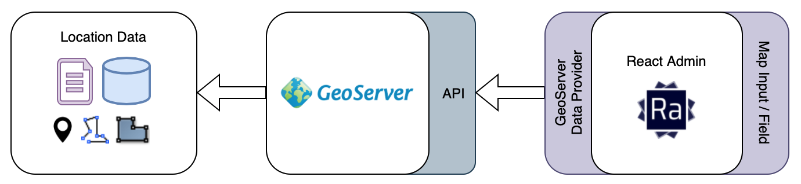

# ra-data-geoserver

A data provider for [react-admin](https://github.com/marmelab/react-admin) for building admin applications with geospatial data on top of [GeoServer](http://geoserver.org/) (through WFS services).



With this data provider, you can connect your GeoServer Features to React-Admin, to view & edit geospatial data.

## Installation

```sh
npm install --save ra-data-geoserver
```

## Usage

This data provider requires these parameters:

-   geoserverBaseURL: base url where GeoServer is running (remember to enable CORS)
-   geoserverWorkspace: geoserver workspace where features are published (not support for multiple workspaces)
-   geoserverUser: geoserver user with permissions to access WFS Services
-   geoserverPassword: geoserverUser password

```jsx
// in src/App.js
import * as React from "react"
import { Admin, Resource } from "react-admin"
import geoServerProvider from "ra-data-geoserver"

const dataProvider = geoServerProvider({
    geoserverBaseURL: "http://localhost:3000/geoserver",
    geoserverWorkspace: "tiger",
    geoserverUser: process.env.REACT_APP_GEOSERVER_USER,
    geoserverPassword: process.env.REACT_APP_GEOSERVER_PASSWORD,
})
import { PoiList } from "./resources/poi"

const App = () => (
    <Admin dataProvider={dataProvider}>
        <Resource name="poi" list={PoiList} />
    </Admin>
)

export default App
```

An example application is available [here](./example/README.md)

# Features

Some features are still in progress:

-   [x] Basic CRUD Features
-   [x] Sorting columns (fid is not supported on GeoServer)
-   [x] Support Point, MultiLineString and MultiPolygon geometries
-   [ ] Multiple actions (getMany/getManyReference, updateMany, deleteMany)
-   [ ] Custom geometry field name (default 'the_geom')

## License

This data provider is licensed under the MIT License
